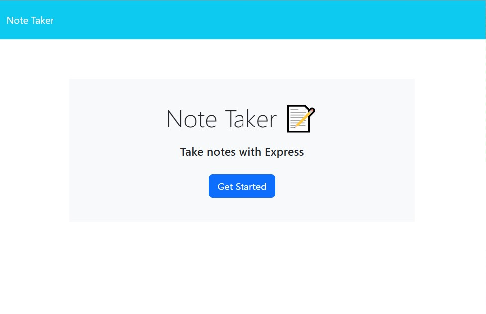
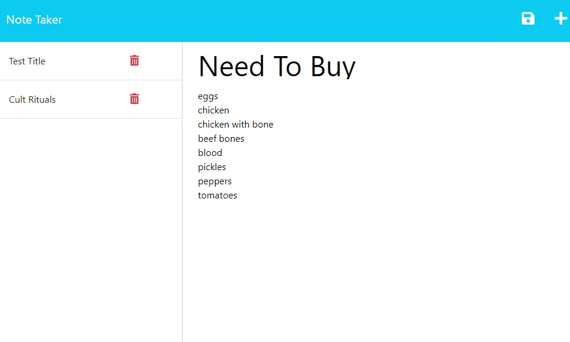

# Express Note Taker
An Express JS Note Taker that is simple and fast in jotting down notes that the user can save and delete.

# Built With
* JSON
* Heroku
* Javascript
* Node.js

# Website Preview

# Website Link

[Deployed website](https://guarded-castle-94395-2fed8c50864d.herokuapp.com/)

# Liscense
